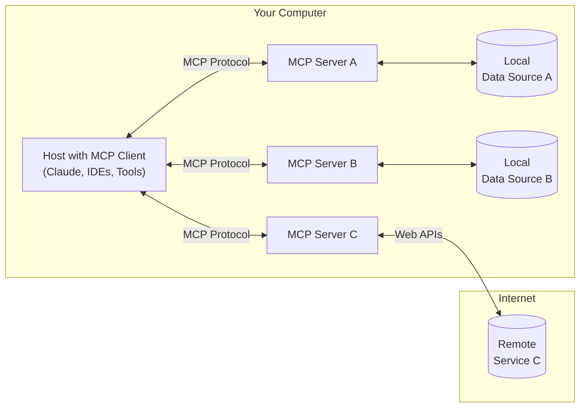

# CUSTOM MCP SERVER
> Get started building your own server to use in Claude for Desktop and other clients.

This README file provides a comprehensive guide on creating a custom MCP server and publishing it as a package to PyPI. Follow the steps outlined to build, configure, and deploy your server effectively.

---

## What is Model Context Protocol (MCP)?

**MCP** stands for **Model Context Protocol** — it's a protocol that allows developers to extend AI assistants (like Claude) with custom tools and servers.

- **Example**: You can build weather servers, calculators, finance assistants, or anything you imagine.

MCP is an open protocol that standardizes how applications provide context to LLMs. Think of MCP like a USB-C port for AI applications. Just as USB-C provides a standardized way to connect your devices to various peripherals and accessories, MCP provides a standardized way to connect AI models to different data sources and tools.

---

## General Architecture



### Key Components

- **MCP Hosts**: Programs like Claude Desktop, IDEs, or AI tools that want to access data through MCP.
- **MCP Clients**: Protocol clients that maintain 1:1 connections with servers.
- **MCP Servers**: Lightweight programs that each expose specific capabilities through the standardized Model Context Protocol.
- **Local Data Sources**: Your computer's files, databases, and services that MCP servers can securely access.
- **Remote Services**: External systems available over the internet (e.g., through APIs) that MCP servers can connect to.

---

### Why MCP?

MCP helps you build agents and complex workflows on top of LLMs. LLMs frequently need to integrate with data and tools, and MCP provides:

- A growing list of pre-built integrations that your LLM can directly plug into.
- The flexibility to switch between LLM providers and vendors.
- Best practices for securing your data within your infrastructure.

---

## What is an MCP Server?

A Model Context Protocol (MCP) server is a service that connects AI models to external data sources and tools.

### Core MCP Concepts

MCP servers can provide three main types of capabilities:

1. **Resources**: File-like data that can be read by clients (like API responses or file contents).
2. **Tools**: Functions that can be called by the LLM (with user approval).
3. **Prompts**: Pre-written templates that help users accomplish specific tasks.

---

## What We'll Be Building

### File Analysis MCP

A Model Context Protocol (MCP) server providing tools for text file analysis.

### Features

- Text analysis tools (word count, character frequency, etc.)
- File reading capabilities
- Directory listing
- File content access via MCP resources

---

## Installation

```bash
pip install file_analysis_mcp
```

> **Note**: We've chosen Claude Desktop here for demonstration purposes.

<details>
<summary>Why Claude for Desktop and not Claude.ai?</summary>
Because servers are locally run, MCP currently only supports desktop hosts.
</details>

This tutorial will primarily focus on tools.

Let's get started with building our file analysis server!  
[You can find the complete code for what we'll be building here.](https://github.com/varunidealabs/file_analysis_mcp.git)

---

## Prerequisite Knowledge

This quickstart assumes you have familiarity with:

- Python
- LLMs like Claude

---

## System Requirements

- Python 3.10 or higher installed.
- You must use the Python MCP SDK 1.2.0 or higher.

---

## Set Up Your Environment

First, let's install `uv` and set up our Python project and environment:

### **UV**: A fast Python package and project manager, written in Rust.

#### MacOS/Linux

```bash
curl -LsSf https://astral.sh/uv/install.sh | sh
```

#### Windows

```powershell
powershell -ExecutionPolicy ByPass -c "irm https://astral.sh/uv/install.ps1 | iex"
```

> **Note**: Restart your terminal afterwards to ensure that the `uv` command gets picked up.

---

### Create and Set Up Your Project

#### MacOS/Linux

```bash
# Create a new directory for our project
uv init file_analysis_mcp
cd file_analysis_mcp

# Create virtual environment and activate it
uv venv
source .venv/bin/activate

# Install dependencies
uv add "mcp[cli]"

# Create our server directory and files
mkdir -p src/file_analysis_mcp
touch src/file_analysis_mcp/server.py
touch src/file_analysis_mcp/__init__.py
```

#### Windows

```powershell
# Create a new directory for our project
uv init file_analysis_mcp
cd file_analysis_mcp

# Create virtual environment and activate it
uv venv
.venv\Scripts\activate

# Install dependencies
uv add "mcp[cli]"

# Create our server directory and files
mkdir -p src\file_analysis_mcp
new-item src\file_analysis_mcp\server.py
new-item src\file_analysis_mcp\__init__.py
```

---

## Building Your Server

### Importing Packages and Setting Up the Instance

Let's implement our server in `src/file_analysis_mcp/server.py`:

```python
from fastmcp import FastMCP, Context
from typing import Dict, List, Any
import os
from collections import Counter

# Create the MCP server
mcp = FastMCP(
    "File Analysis",
    dependencies=["fastmcp"],
    description="Tools for analyzing text files"
)

@mcp.tool()
def analyze_text(text: str) -> Dict[str, Any]:
    """
    Analyze text content and provide statistics.
    
    Args:
        text: The text content to analyze
        
    Returns:
        Dictionary with text statistics
    """
    # Calculate basic statistics
    char_count = len(text)
    word_count = len(text.split())
    line_count = len(text.splitlines())
    
    # Character frequency analysis
    char_freq = dict(Counter(text.lower()))
    
    # Word frequency analysis (simple)
    import re
    words = re.findall(r'\b\w+\b', text.lower())
    word_freq = dict(Counter(words).most_common(10))
    
    return {
        "statistics": {
            "character_count": char_count,
            "word_count": word_count,
            "line_count": line_count,
        },
        "character_frequency": char_freq,
        "top_words": word_freq
    }

@mcp.tool()
def read_file(file_path: str) -> str:
    """
    Read the contents of a text file.
    
    Args:
        file_path: Path to the file to read
        
    Returns:
        File contents as text
    """
    if not os.path.exists(file_path):
        return f"Error: File not found at {file_path}"
    
    try:
        with open(file_path, 'r', encoding='utf-8') as f:
            return f.read()
    except Exception as e:
        return f"Error reading file: {str(e)}"

@mcp.tool()
def list_files(directory: str = ".") -> Dict[str, List[str]]:
    """
    List files in a directory.
    
    Args:
        directory: Directory path to list files from (defaults to current directory)
        
    Returns:
        Dictionary with lists of files and directories
    """
    if not os.path.exists(directory):
        return {"error": f"Directory not found: {directory}"}
    
    try:
        contents = os.listdir(directory)
        files = [item for item in contents if os.path.isfile(os.path.join(directory, item))]
        dirs = [item for item in contents if os.path.isdir(os.path.join(directory, item))]
        
        return {
            "files": files,
            "directories": dirs
        }
    except Exception as e:
        return {"error": f"Error listing directory: {str(e)}"}

@mcp.resource("file://{file_path}")
def get_file_resource(file_path: str) -> str:
    """
    Access a file as a resource.
    
    Args:
        file_path: Path to the file
        
    Returns:
        File contents as text
    """
    return read_file(file_path)

def run():
    """Run the MCP server"""
    mcp.run()

if __name__ == "__main__":
    run()
```

---

### Create the Package Initialization

In `src/file_analysis_mcp/__init__.py`:

```python
"""File Analysis MCP Server - Tools for analyzing text files"""

from .server import mcp, run

__version__ = "0.1.0"
```

Your server is complete! Run `uv run server.py` to confirm that everything's working.

---

### Usage

Running with the MCP Inspector:
```bash 
mcp-file-analysis dev
```

Integrating with Claude Desktop:
```bash
mcp-file-analysis install
```

## Testing and Debugging Locally

The **MCP Inspector** is an interactive developer tool for testing and debugging MCP servers.

### Inspecting Locally Developed Servers

For TypeScript:
```bash
npx @modelcontextprotocol/inspector node path/to/server/index.js args...
```

For Python:
```bash
npx @modelcontextprotocol/inspector uv --directory path/to/server run package-name args...
```

### Inspecting Servers from NPM or PyPI

```bash
npx @modelcontextprotocol/inspector uvx <package-name> <args>
```

**Example**:

```bash
npx @modelcontextprotocol/inspector uvx mcp-server-git --repository ~/code/mcp/servers.git
```

---

## Testing Your Server with Claude for Desktop

> **Note**: Claude for Desktop is not yet available on Linux.

### Configure Claude for Desktop

Open your Claude for Desktop App configuration file at:

- **MacOS/Linux**: `~/Library/Application Support/Claude/claude_desktop_config.json`
- **Windows**: `$env:AppData\Claude\claude_desktop_config.json`

If the file doesn't exist, create it.

#### Example Configuration

**MacOS/Linux**:

```json
{
    "mcpServers": {
        "file_analysis": {
            "command": "uv",
            "args": [
                "--directory",
                "/ABSOLUTE/PATH/TO/PARENT/FOLDER/file_analysis_mcp",
                "run",
                "server.py"
            ]
        }
    }
}
```

**Windows**:

```json
{
    "mcpServers": {
        "file_analysis": {
            "command": "uv",
            "args": [
                "--directory",
                "C:\\ABSOLUTE\\PATH\\TO\\PARENT\\FOLDER\\file_analysis_mcp",
                "run",
                "server.py"
            ]
        }
    }
}
```

> **Warning**: You may need to provide the full path to the `uv` executable in the `command` field. Use `which uv` (MacOS/Linux) or `where uv` (Windows) to find it.

Save the file and restart **Claude for Desktop**.

---

## Building and Publishing to PyPI

**PyPI** facilitates the sharing and distribution of Python packages, allowing developers to easily access and utilize code written by others.

### Build the Package

Install build tools:

```bash
pip install --upgrade build twine
```

Build the package:

```bash
python -m build
```

### Upload to TestPyPI

```bash
python -m twine upload --repository testpypi dist/*
```

You'll be prompted for your TestPyPI `username` and `password`.

### Test the Installation from TestPyPI

```bash
pip install --index-url https://test.pypi.org/simple/ --no-deps file-analysis-mcp
```

### Register on the Real PyPI

If the TestPyPI upload and installation works correctly:

1. Register at [PyPI](https://pypi.org/account/register/).
2. Verify your email address.

### Upload to PyPI

```bash
python -m twine upload dist/*
```

Enter your PyPI credentials when prompted.

## User Installation and Usage Guide

Here's a comprehensive guide for users on how to install and use your MCP server.

### Installation

```bash
pip install file-analysis-mcp
```

This will install the file-analysis-mcp package and its dependencies, including FastMCP.

### Running the Server

#### Method 1: Using Command Line Interface

The package provides a command-line interface that can be used directly:

```bash
# Run with the MCP Inspector (for testing and development)
mcp-file-analysis dev

# Install in Claude Desktop
mcp-file-analysis install
```

#### Method 2: Using as a Library

Users can also import and use your server in their own code:

```python
from file_analysis_mcp import mcp

# Run the server
mcp.run()
```
